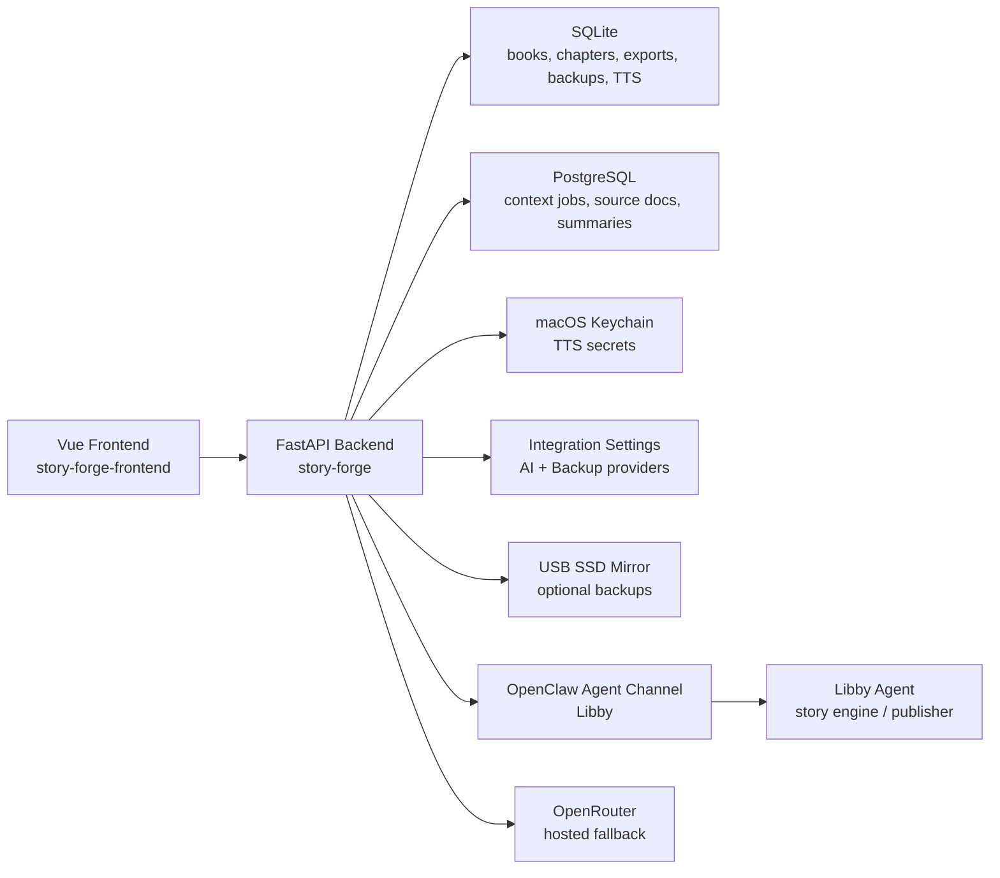
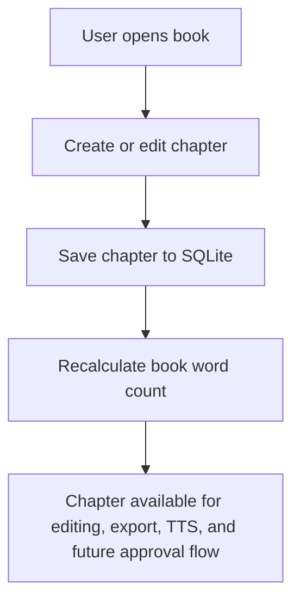
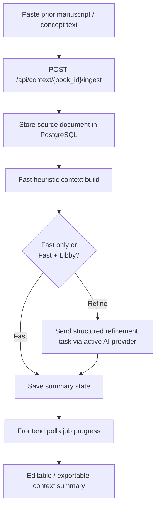
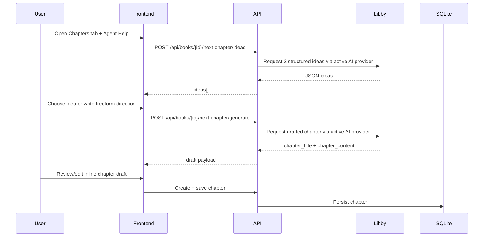

# Story Forge Backend

Story Forge is a local-first publishing workflow backend for managing books, chapters, context memory, Libby-assisted drafting, manuscript exports, backups, and text-to-speech generation.

The canonical stack is:

- FastAPI backend in this repo
- Vue 3 frontend in the companion `story-forge-frontend` repo
- Local Mac runtime
- SQLite for the active writing pipeline
- Local PostgreSQL for context engine state
- Configurable AI provider layer: OpenClaw or OpenRouter

## Current Capabilities

- Book and chapter CRUD
- Inline chapter drafting plus full chapter editor workflow
- Context-only manuscript ingestion with async progress
- Optional Libby-assisted context refinement
- Libby-assisted next chapter ideas and draft generation
- Install-level Integrations settings for AI and backup providers
- Persistent per-user profile settings for theme, editor defaults, and voice preferences
- Multi-format manuscript export and export-package workflow
- Local encrypted backups with configurable local-only or USB SSD target
- Google Drive backup upload / list / restore / delete when Drive access is granted
- TTS provider configuration and audio generation
- Review-mode auth bypass for local development

## Architecture Overview



## Key Runtime Flows

### 1. Standard Writing Flow



### 2. Context Engine Flow



### 3. Libby Next Chapter Flow



## Repository Structure

```text
story-forge/
├── fastapi_app.py          # FastAPI entry point and router wiring
├── routes/                 # API route modules
│   ├── books.py
│   ├── chapters.py
│   ├── context.py
│   ├── libby_workflow.py
│   ├── manuscript.py
│   ├── backups.py
│   └── voice_studio.py
├── db.py                   # SQLite models and engine
├── db_helpers.py           # SQLite access helpers
├── context_db.py           # PostgreSQL context engine models and session setup
├── context_engine.py       # Context ingestion, refinement, export, job progress
├── ai_providers.py         # AI provider routing for OpenClaw / OpenRouter
├── integrations.py         # Install-level integration settings and status
├── libby.py                # OpenClaw-backed Libby transport and parsing
├── manuscript.py           # Export and manuscript package generation
├── backup.py               # Local encrypted backups + USB sync
├── tts.py                  # TTS provider logic and keychain integration
├── auth.py                 # OAuth/session helpers
├── requirements.txt        # Backend dependencies
├── tests/                  # Backend regression tests
└── data/                   # Local runtime SQLite data
```

## Data Boundaries

- SQLite is the source of truth for books, chapters, exports, TTS jobs, and backup-related app state.
- PostgreSQL is the source of truth for context ingestion jobs, context source documents, and context summaries.
- Libby is not treated as a database. She is an agent transport target used for refinement and drafting tasks.

## Provider Settings

- `GET /api/integrations` returns current integration settings and live status.
- `PUT /api/integrations/ai` configures the active AI provider.
- `PUT /api/integrations/backup` configures the active backup target.
- `GET /api/auth/preferences` returns saved per-user profile settings.
- `PUT /api/auth/preferences` updates profile settings such as theme, editor font size, and default TTS provider.
- OpenRouter API keys are stored in macOS Keychain.
- ElevenLabs API keys can be stored in macOS Keychain or entered through the Integrations screen for non-local setups.
- Google Drive backup uses the signed-in Google account plus Drive file access.

## Libby Integration

Story Forge no longer assumes Libby is running as a custom HTTP server on `localhost:8100`.

Current behavior:

- Story Forge can route chapter ideation, draft generation, and context refinement through either OpenClaw or OpenRouter
- OpenClaw calls are routed through the local `openclaw` CLI
- JSON-only prompts are used for context refinement, next-chapter ideas, and draft generation
- Chapter creation and chapter edits now build background voice-map JSON artifacts for Voice Studio, including a per-book character roster and a per-chapter narration/dialogue plan.
- Voice Studio currently uses an ElevenLabs-first workflow; the architecture remains extensible for additional voice providers later.
- Response parsing is hardened for OpenClaw’s nested `result.payloads[].text` output shape

## Running Locally

### Backend Only

```bash
git clone https://github.com/gptkiosk/story-forge.git
cd story-forge
python -m venv .venv
source .venv/bin/activate
pip install -r requirements.txt
uvicorn fastapi_app:app --reload --port 8000
```

### Full Local App

Use the local launcher:

```bash
/Users/masterblaster/test-app.sh story-forge 8000 5173
```

That launcher currently:

- clones fresh app code into `/tmp`
- persists Story Forge test data outside `/tmp`
- provisions persistent PostgreSQL for context-engine testing
- can auto-use Colima/Docker for the Postgres sidecar path

## Environment Notes

- `REVIEW_MODE=true` enables local auth bypass.
- `STORY_FORGE_USB_PATH=/Volumes/xtra-ssd` overrides the default USB backup mount.
- `STORY_FORGE_CONTEXT_POSTGRES_URL` sets the context-engine PostgreSQL connection.
- `LIBBY_TRANSPORT=openclaw` remains the supported local Libby transport.
- `LIBBY_AGENT_ID=libby` is the default OpenClaw target, but Integrations settings now control the active agent id.
- `OPENROUTER_MODEL` can seed the default hosted model choice.
- `GOOGLE_REDIRECT_URI` should match your configured OAuth callback URL, typically `/api/auth/callback` on the active app origin.
- TTS provider keys are stored in macOS Keychain.

## Verification

Backend contributors should run:

```bash
pytest tests -q
```

## Contributor Notes

- Follow [CODE_STANDARDS.md](/Users/masterblaster/.openclaw/agents/lance/workspace/story-forge/CODE_STANDARDS.md) for backend coding, testing, and architecture expectations.
- Keep docs current when transport, storage, or workflow assumptions change.

## Legacy Status

- NiceGUI is legacy and no longer the supported UI path.
- GCS / Cloud Run assumptions are not part of the active local-first workflow.
- Terraform files may remain as historical scaffolding, but they do not describe the supported runtime.


## Auth Notes

- Real Google sign-in requires `AUTH_ENABLED=1`, `DEV_MODE=0`, valid Google OAuth credentials, and a matching `GOOGLE_REDIRECT_URI`.
- Story Forge stores the originating frontend URL during `/api/auth/login` so Google OAuth returns the browser to the right frontend screen after callback.
- Google Drive backup uses the same Google account with the `drive.file` scope and uploads encrypted `.sfbackup` packages into the configured folder.
